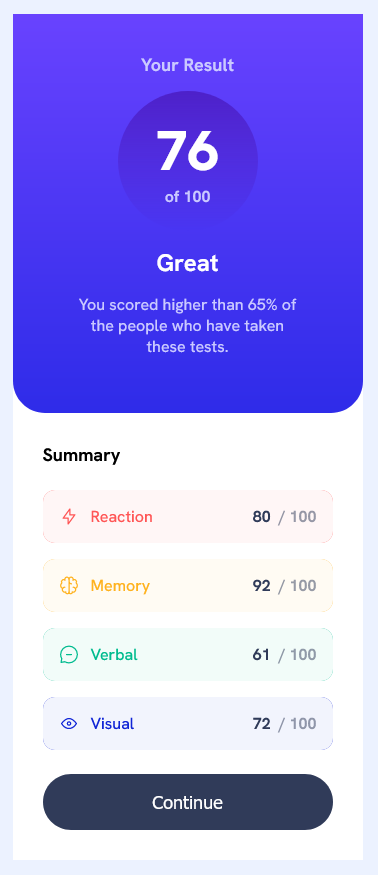
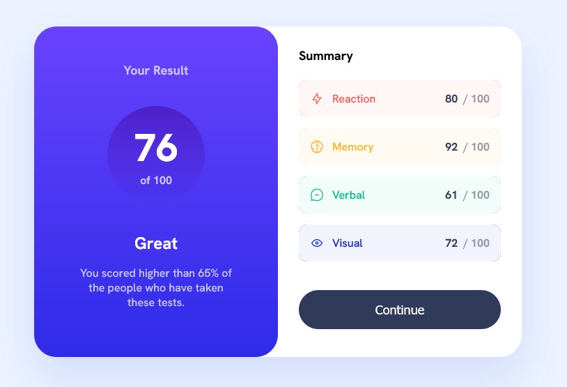

# Frontend Mentor - Results summary component solution

This is a solution to the [Results summary component challenge on Frontend Mentor](https://www.frontendmentor.io/challenges/results-summary-component-CE_K6s0maV). Frontend Mentor challenges help you improve your coding skills by building realistic projects. 

## Table of contents

- [Overview](#overview)
  - [The challenge](#the-challenge)
  - [Screenshot](#screenshot)
  - [Links](#links)
- [My process](#my-process)
  - [Built with](#built-with)
  - [What I learned](#what-i-learned)

## Overview

### The challenge

Users should be able to:

- View the optimal layout for the interface depending on their device's screen size
- See hover and focus states for all interactive elements on the page

### Screenshot

### Links

- [Solution URL](https://github.com/markuskulmer/frontend-mentor/tree/main/results-summary-component-main)
- [Live Site URL](https://63f1d2519a6b0f00086c44f7--bejewelled-stroopwafel-169c8a.netlify.app/results-summary-component-main)

## My process

### Built with

- Semantic HTML5 markup (BEM)
- SCSS
- Flexbox
- CSS Grid
- Mobile-first workflow

### What I learned

I found out that some problems are easier to solve with grid than flexbox, even if it doesnt seem so at first.
For example, in the "div.score", there are two divs without fixed width. If they should be placed side by side, setting the parent to "display: grid" and giving both columns "1fr" width is way easier than trying to do so by using flexbox.

I was not able to make both child divs the same width using flexbox, if you know how to do so, please let me konw.

If you find any flaws in the used BEM notation, I would also be happy to learn about it.